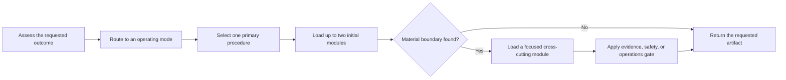

# AI Engineer

[](https://github.com/IShalkin/ai-engineer/actions/workflows/validate.yml)

`ai-engineer` is a production-oriented skill for Claude Code, Codex, and other agents that support `SKILL.md`. It helps an agent explain, design, review, implement, debug, evaluate, secure, and operate AI/ML systems without turning every request into a heavyweight architecture exercise.

The skill combines a proportional execution model with 75 stable engineering procedures covering predictive ML, RAG and search, context engineering, tool-using agents, multi-agent systems, security, evaluation, judge calibration, regulated domains, financial-crime and fraud model risk, managed agent runtimes, and production operations.

## What is in the package

| Part | Contents |
|---|---|
| `skills/ai-engineer` | the router: `SKILL.md` plus the `references/*.md` modules and 2 validators |
| `skills/ai-eval`, `skills/ai-agent-design`, `skills/ai-regulated` | three fork skills that run a narrow analysis in their own context and route into the same modules |
| `agents/ai-engineer` | the producing agent — designs, implements, verifies |
| `agents/ai-engineer-critic` | the adversarial reviewer — read-only, refutes, never fixes |

**Hook-free.** Nothing in the package requires a hook, because some environments forbid them by policy.
The critic is read-only because `Bash`, `Write` and `Edit` are absent from its tool grant — a tool never
granted is a mechanism, while a filter over shell commands is best-effort. That costs the critic
mutation testing and buys an enforcement that holds everywhere. See
[Hook-free profile](docs/usage.md#hook-free-profile) for what is traded away and for the one residual
gap the design does not close.

## Why use it

- Start with the smallest sufficient system instead of a framework-first design.
- Separate explanations, designs, reviews, implementations, and evaluation execution.
- Discover important boundaries an inexperienced developer may not know to ask about.
- Keep current APIs and provider behavior grounded in official documentation.
- Treat prompts, retrieved content, tools, memory, and agent messages as trust boundaries.
- Preserve explicit baselines, evidence, fallback, rollback, and operational ownership.

## How it works



The four operating modes are:

1. **Explain** — answer a concept or trade-off directly.
2. **Design** — produce an architecture, plan, ADR, evaluation specification, or system design.
3. **Review** — inspect evidence and report findings before any readiness verdict.
4. **Implement** — make scoped changes and verify them in proportion to risk.

Evaluation is not launched merely because evaluation is discussed. The skill runs benchmarks or graders only when the user explicitly asks to execute them and supplies the required target, data, tools, budget, and authority.

## Installation

Clone the repository, then copy the parts your agent supports.

### Claude Code

```bash
git clone https://github.com/IShalkin/ai-engineer.git
mkdir -p ~/.claude/skills ~/.claude/agents
cp -R ai-engineer/skills/. ~/.claude/skills/
cp ai-engineer/agents/*.md ~/.claude/agents/
```

On Windows PowerShell:

```powershell
git clone https://github.com/IShalkin/ai-engineer.git
New-Item -ItemType Directory -Force "$HOME\.claude\skills", "$HOME\.claude\agents" | Out-Null
Copy-Item -Recurse -Force .\ai-engineer\skills\* "$HOME\.claude\skills\"
Copy-Item -Force .\ai-engineer\agents\*.md "$HOME\.claude\agents\"
```

Copy all four skills, not only `ai-engineer`: the three fork skills link into
`../ai-engineer/references/` and need it as a sibling directory.

### Codex

Codex supports the skill, not the agents:

```bash
git clone https://github.com/IShalkin/ai-engineer.git
mkdir -p ~/.codex/skills
cp -R ai-engineer/skills/. ~/.codex/skills/
```

On Windows PowerShell:

```powershell
git clone https://github.com/IShalkin/ai-engineer.git
New-Item -ItemType Directory -Force "$HOME\.codex\skills" | Out-Null
Copy-Item -Recurse -Force .\ai-engineer\skills\* "$HOME\.codex\skills\"
```

Restart the agent after installation if it does not refresh skills automatically.

## Usage

Invoke it explicitly:

```text
Use $ai-engineer to design a production RAG service for internal policy documents.
```

Or ask naturally when your agent supports automatic skill triggering:

```text
Review this ML design and repository for production readiness.
```

```text
Explain when a workflow should become an agent and what evidence would justify multi-agent architecture.
```

```text
Implement a durable approval step with pause, resume, cancellation, and idempotent side effects.
```

See [Usage patterns](docs/usage.md) for reusable prompts and expected outputs.

## Methods

The core methods are documented in [Methods and decision model](docs/methods.md):

- ASRO: Assess → Route → Select → Output;
- proportional execution and progressive context loading;
- the system-shape ladder;
- requirements and unknown-unknown discovery;
- source provenance and current-document maintenance;
- ML lifecycle and evidence-aware review;
- RAG, agent, security, evaluation, and production gates.

## Current documentation and Context7

Version-sensitive advice activates the current-document workflow:

```text
identify installed/target version
→ optionally discover with Context7 MCP
→ verify against version-matched official documentation
→ apply the verified rule
→ update the canonical link and access date when authorized
```

Context7 is optional and accelerates discovery; it is not the final provenance boundary. See [Current documentation workflow](docs/current-documentation.md).

## Public source boundary

This repository contains synthesized engineering procedures, and that is the whole package: nothing installs alongside it, and no source pack is pending. It carries no copyrighted books or PDFs, which costs exactly one thing - an exact citation with chapter, page, or section requires a source artifact you supply at the time, with an identity, hash, and locator. `COV-01` is the procedure for doing that.

## What this package does not enforce

Everything here is text a model reads, and text can be declined. Only two things are enforced mechanically: the tool grant (the reviewer agent has no write tools, so it cannot edit what it reviews) and the two validators below (structure, addressing, countability). In particular, the review-debt rule, the module budget, and the mode announcements are conventions the model follows, not gates that stop it — and the `verified <date>` markers in the corrections overlay are static text, checked for age but never re-verified against a source by any script here. Read a green validator run as "the package is structurally intact", never as "the advice is current".

## Validation

```bash
python skills/ai-engineer/scripts/validate_current_corrections.py
python skills/ai-engineer/scripts/validate_public_skill.py
```

The same checks run automatically on GitHub for every push and pull request.

## License

[MIT](LICENSE)
