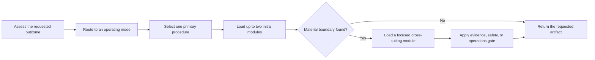

# AI Engineer

[](https://github.com/IShalkin/ai-engineer/actions/workflows/validate.yml)

`ai-engineer` is a production-oriented skill for Claude Code, Codex, and other agents that support `SKILL.md`. It helps an agent explain, design, review, implement, debug, evaluate, secure, and operate AI/ML systems without turning every request into a heavyweight architecture exercise.

The skill combines a proportional execution model with 52 stable engineering procedures covering predictive ML, RAG and search, context engineering, tool-using agents, multi-agent systems, security, evaluation, and production operations.

## Why use it

- Start with the smallest sufficient system instead of a framework-first design.
- Separate explanations, designs, reviews, implementations, and evaluation execution.
- Discover important boundaries an inexperienced developer may not know to ask about.
- Keep current APIs and provider behavior grounded in official documentation.
- Treat prompts, retrieved content, tools, memory, and agent messages as trust boundaries.
- Preserve explicit baselines, evidence, fallback, rollback, and operational ownership.

## How it works



The four operating modes are:

1. **Explain** — answer a concept or trade-off directly.
2. **Design** — produce an architecture, plan, ADR, evaluation specification, or system design.
3. **Review** — inspect evidence and report findings before any readiness verdict.
4. **Implement** — make scoped changes and verify them in proportion to risk.

Evaluation is not launched merely because evaluation is discussed. The skill runs benchmarks or graders only when the user explicitly asks to execute them and supplies the required target, data, tools, budget, and authority.

## Installation

Clone the repository, then copy `skills/ai-engineer` into the skills directory used by your agent.

### Claude Code

```bash
git clone https://github.com/IShalkin/ai-engineer.git
cp -R ai-engineer/skills/ai-engineer ~/.claude/skills/ai-engineer
```

### Codex

```bash
git clone https://github.com/IShalkin/ai-engineer.git
cp -R ai-engineer/skills/ai-engineer ~/.codex/skills/ai-engineer
```

On Windows PowerShell:

```powershell
git clone https://github.com/IShalkin/ai-engineer.git
Copy-Item -Recurse -Force .\ai-engineer\skills\ai-engineer "$HOME\.codex\skills\ai-engineer"
```

Restart the agent after installation if it does not refresh skills automatically.

## Usage

Invoke it explicitly:

```text
Use $ai-engineer to design a production RAG service for internal policy documents.
```

Or ask naturally when your agent supports automatic skill triggering:

```text
Review this ML design and repository for production readiness.
```

```text
Explain when a workflow should become an agent and what evidence would justify multi-agent architecture.
```

```text
Implement a durable approval step with pause, resume, cancellation, and idempotent side effects.
```

See [Usage patterns](docs/usage.md) for reusable prompts and expected outputs.

## Methods

The core methods are documented in [Methods and decision model](docs/methods.md):

- ASRO: Assess → Route → Select → Output;
- proportional execution and progressive context loading;
- the system-shape ladder;
- requirements and unknown-unknown discovery;
- source provenance and current-document maintenance;
- ML lifecycle and evidence-aware review;
- RAG, agent, security, evaluation, and production gates.

## Current documentation and Context7

Version-sensitive advice activates the current-document workflow:

```text
identify installed/target version
→ optionally discover with Context7 MCP
→ verify against version-matched official documentation
→ apply the verified rule
→ update the canonical link and access date when authorized
```

Context7 is optional and accelerates discovery; it is not the final provenance boundary. See [Current documentation workflow](docs/current-documentation.md).

## Public source boundary

This repository contains synthesized engineering procedures. It does not contain copyrighted books, PDFs, or private book-derived source packs. Exact book reconstruction requires a separately supplied source artifact with an identity, hash, and chapter/page/section locator.

## Validation

```bash
python skills/ai-engineer/scripts/validate_current_corrections.py
python skills/ai-engineer/scripts/validate_public_skill.py
```

The same checks run automatically on GitHub for every push and pull request.

## License

[MIT](LICENSE)
